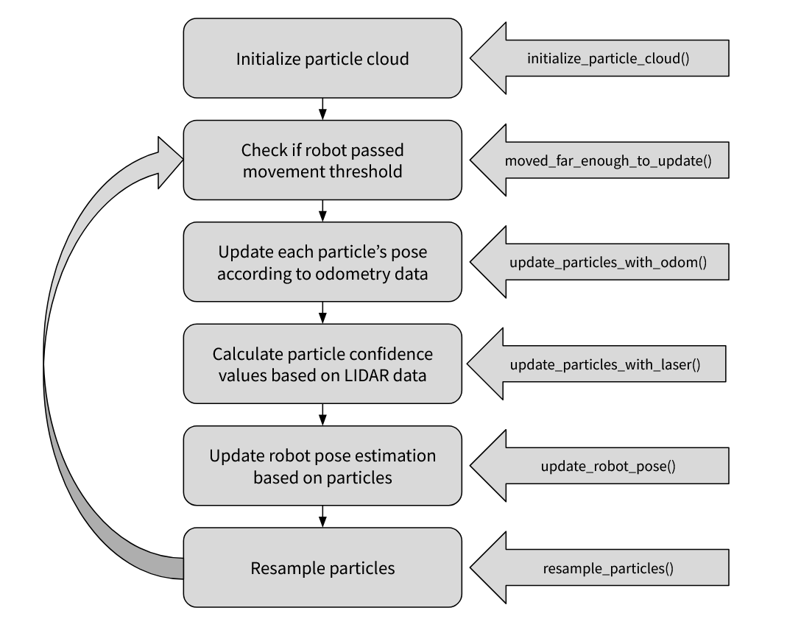

# Project Goal:
The goal of this project was to implement a particle filter in ROS2 to estimate a mobile robot’s pose within a known map. To do this, we utilized both LIDAR and odometry data to produce an accurate pose estimate, visualizing our resulting particle cloud and pose estimate in RViz. This allows us to verify the robot’s estimated pose relative to its actual location, especially with being able to see the LIDAR scan points overlaid over the occupancy grid / map.

Here is a demo of the particle filter (sped up 4x). The green arrow represents the estimated pose, each blue arrow represents a particle, the red dots are the laser scan endpoints, and the map is the occupancy grid.

## Approach Overview:
Below is a flow chart that overviews the entire process with how a particle filter can generate a pose estimate:

In this project, most of the focus went towards the design and implementation of the following functions: `initialize_particle_cloud()`, `update_particles_with_odom()`, `update_particles_with_laser()`, `update_robot_pose()`, and `resample_particles()`.

Most of the helper functions were provided to us, though we did write a few that were used extensively in the filter.

## Initializing Particle Cloud:
The `initialize_particle_cloud()` function defines the initial belief of the robot’s position and orientation within the environment. It creates a set of 300 particles (chosen as a balance between exploration and computational effort), each representing a potential hypothesis of the robot’s pose $(x, y, \theta)$ in the map frame. We designed the function so that it can operate in two modes depending on whether an initial estimate is available. If the initial pose estimate is provided, particles are distributed according to a Gaussian distribution centered around that pose, allowing the filter to gain a possible jumpstart with convergence. If no initial estimate is available, the particles are randomly generated with a uniform distribution within map bounds to represent complete uncertainty about the robot’s location. In either case, if a particle is initialized too close to any obstacle, determined by the occupancy field, it is discarded to ensure that only physically valid poses are included. Each particle is assigned an equal weight (1/N), and the set of weights is normalized so that they form a valid probability distribution.

## Prediction Step / Motion Update:
The `update_particles_with_odom()` function applies the robot’s odometry information to propagate the particles forward in time, which is essentially the prediction step of the particle filter. The function calculates the change in pose by subtracting the previous timestep’s odometry data from the current, and then applies this change with respect to each particle’s pose in the map frame. A small amount of Gaussian noise is then added to each particle’s updated pose in order to model odometry uncertainty, such as wheel slippage or encoder drift. This additional step ensures that the particle set represents a realistic spread of possible robot poses given the inherent uncertainty in motion estimation. As a result, the updated particle cloud provides a prediction of where the robot might be after its most recent movement.

## Confidence Value Computation:
The `update_particles_with_laser()` function represents the measurement correction step of the particle filter. In this phase, each particle’s confidence value is updated according to how well its predicted sensor readings align with the actual LIDAR measurements received from the robot. For each particle, a subset of laser beams from the scan data is transformed into the map frame based on the particle’s pose, where the closest distance of each beam endpoint is calculated based on the occupancy map. These closest distance values are used in a likelihood field model to compute the probability of the observed scan for each particle’s pose, which directly reflects the particle’s confidence. The likelihood field model assumes a Gaussian error distribution centered on every obstacle point in the map, meaning particles that predict laser hits near real obstacles (smaller closest distance) receive higher confidence values, while those that predict hits far from obstacles (larger closest distance) receive low confidence values. After processing all valid beams, the particle weights are normalized to maintain a valid probability distribution. 

Below are the equations representing the process used to calculate particle confidence values:

$$
P(z_t^k \mid x_t, m) = \exp\left(-\frac{d^2}{2\sigma^2}\right)
$$

$$
P(z_t \mid x_t, m) = \prod_{k=1}^{K} P(z_t^k \mid x_t, m)
$$

## Update Robot Pose:
The `update_robot_pose()` function computes the robot’s estimated pose based on the current set of weighted particles. After particle confidence values have been updated and normalized, they are then sorted by confidence value in ascending order. This allows a subset of particles within the top 5% of confidence values to be separated, where then the average position is computed directly from the mean of the selected particles. The top 5% was chosen semi-arbitrarily to balance robustness and accuracy of our pose estimate. One piece of justification is that a large portion of particles are poor estimates with low confidence values, which can significantly skew results. It is instead desirable to have the pose estimate be dominated by high confidence particles. Additionally, with how resampling introduces stochastic noise into the distribution (explained further in the next section), averaging pose over a larger range of confidence values would result in a much noisier estimate.

## Resampling Particles:
The `resample_particles()` function aims to redistribute the whole set of particles based on both the previously calculated confidence values and uniform randomness. An issue arises where once confidence values are updated, the majority of particles end up with very low confidence values, resulting in insignificant contributions to the pose estimate. A solution would be to redistribute the particles in a manner that would make them contribute significantly more to the pose estimation process. A fraction of resampling (40%) was done through a probabilistic selection process, where particles with higher confidence values are more likely to be chosen multiple times. This focuses the computational effort on the most probable regions of the map, redistributing low weight particles to be useful by reinforcing high confidence pose estimates. Gaussian noise is also added to the resampled particles, which preserves particle diversity and enables self correcting behavior for minor estimation errors. The other 60% of resampling is done through random distribution within the map bounds (similar to initialization) to allow for global recovery in case of incorrect convergence. The 40-60 split between confidence based and random resampling came from empirical testing, where it was deemed sufficient in reinforcing good estimates while also retaining the ability for global recovery.

## Challenges:
Many of the challenges we faced while attempting to implement the particle filter were related to convergence and stability issues. In early versions of our filter, it was very difficult to achieve consistent convergence due to how confidence values were calculated. The initial approach used an inverse-square relationship based on the combined laser endpoint distance errors. However, this almost always produced multi-modal particle distributions that were both noisy and inaccurate, resulting in poor overall localization performance. As discussed further in the next section, replacing this approach with a likelihood field model significantly improved convergence, and single-modal convergence around the correct pose was achieved. However, a new problem related to stability arose. For instance, when LIDAR data corresponded to the robot traversing from one distinct area into another, the particle mode would occasionally diverge, even if it was previously converged on a good estimate. Additionally, even with the improvements of likelihood model, initial convergence on a correct pose remained unreliable in the case when particles were initialized uniformly without an initial pose guess, likely due to ambiguous geometric features such as similar walls and corners that may result in multiple high confidence particles. In the end, most of these issues were resolved through several design choices, which will be explained in the following section.

## Design Decisions:
The design decisions that contributed the most to the success of our particle filter were mostly made within the functions `update_particles_with_laser()`, `resample_particles()`, and `initialize_particle_cloud()`.

Referring back to the multi-modal convergence issues in the previous section, calculating confidence values based on an inverse square law was an incorrectly justified oversimplification of the sensor model. It was initially thought that an inverse square would result in very high confidence for well positioned laser endpoints and very low confidence for poorly positioned ones. However, further analysis reveals because the inverse square function decreases too sharply with distance, even small measurement deviations were excessively amplified. As a result, particles in significantly different map regions could still receive disproportionately high weights if a few of their laser endpoints happened to align by chance. This caused instability in the weight distribution and prevented the particle cloud from converging smoothly to a consistent mode.

This led to us changing the confidence evaluation to a Gaussian likelihood model, which provided a much smoother and statistically justified weighting scheme. The Gaussian function naturally models sensor noise as a normal distribution, ensuring that small deviations from the expected measurement are penalized mildly, while large deviations are penalized exponentially, which drastically improves convergence. The $\sigma$ parameter, representing measurement noise, became a critical factor for convergence and required a lot of empirical tuning. A small $\sigma$ increases the filter’s sensitivity to measurement differences, promoting faster convergence but risking overconfidence and noise-induced instability. Conversely, a larger $\sigma$ makes the model more tolerant to uncertainty, but at the cost of convergence speed. After many tests in RViz, we settled for a $\sigma$ of 0.2 meters, which balanced these two behaviors well for our environment.

Resampling was another key design choice affecting convergence behavior. Recall how 40% of the particle cloud is resampled through a probabilistic selection process with Gaussian noise added on top. Another $\sigma$ term was used as the standard deviation controlling how much to offset the resampled poses, which proved crucial for both the stability and accuracy of the overall pose estimate. A small $\sigma$ value keeps resampled particles clustered tightly around high confidence regions, forming a compact and confident particle cloud. This results in less noise in the pose estimate when averaging the top weighted particles, but it was also observed that the filter was unstable if converged on an incorrect pose estimate. A larger $\sigma$ value results in a more diverse particle spread, which increases noise in the averaged pose estimate but improves upon the filter’s ability to self correct from local mis-alignments. Again, through a lot of testing, we chose a $\sigma$ value of 0.25 m for (x, y) and 15° for $\theta$, which prioritized self correction capability, though the pose estimation’s noise was still tolerable.

Finally, initialization played a significant role in early convergence. We initially wanted to try uniform random initialization across the map to test robustness, but we observed it made it extremely difficult for the particle filter to lock onto the correct pose, especially since our environment had ambiguous geometrical features. We eventually switched to an initialization centered around an initial pose guess, constraining the initial hypothesis space to plausible regions while maintaining enough variance to self-correct small pose uncertainties. This change greatly improved convergence time and reduced localization errors during startup. We justify this implementation with the reasoning that if you are deploying a robot into an already mapped environment, you would have some idea of where your robot initializes at.

## Future Improvements:
There are a couple improvements to our particle filter that could be made in the future. Even though our particle filter worked well in RViz, developing it to run on a real robot would be a big improvement. Real world testing would put our stochastic modeling to the test, as noise and uncertainties are very present in applied environments. Observing how the filter performs would help us improve its reliability by adjusting our implemented motion and sensor models accordingly. Another improvement that we think is definitely worth pursuing would be implementing adaptive particle resampling, similar to what most AMCL algorithms work. Currently, our implementation uses a constant number of particles, which sometimes results in unneeded particles once the filter has converged well or not enough particles covering a sufficient area during uncertainty. A successful adaptive resampling algorithm would minimize computational power required while remedying the aforementioned issues. Because of this, convergence, stability, and noise reduction capabilities are improved, which were significant issues our implementation struggled with.

## Lessons Learned:
One of the main things we learned from this project was getting a high-level understanding of the particle filter and solid understanding of the skeleton code before properly starting to code. At first, it was difficult to even find where to start. By getting a proper high level understanding, we could begin to break it down into more manageable cases that we could actually code. Reading through the skeleton code was also important. It was not always clear how the different parts worked together or how data moved through the filter. Taking the time to trace the code and see what each section did made it much easier to make changes later.

Another lesson we learned is that, when debugging, it is helpful to make a list of all the constants that rely on assumptions, like threshold values, minimum and maximum distances, or noise levels. These values are good things to check and adjust when debugging. Especially as their initial values were effectively shots in the dark at what we thought they should be. Knowing which numbers could be changed without breaking the system made testing much faster.

Finally, we also learned that small changes and repeated testing are important. Changing one value or adjusting one part of the filter and watching what happened in RViz helped us understand what worked and what didn’t. This is an essential part of the debugging process. Overall, this project showed us the value of getting a high level understanding of the challenge, properly going over the available skeleton/helper code, and having established debugging strategies, as well as taught us how to make a particle filter for robot localization!
